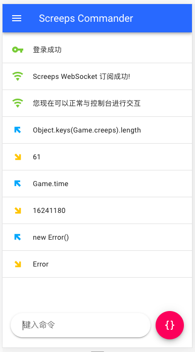
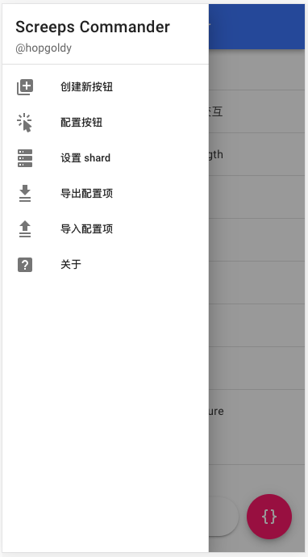
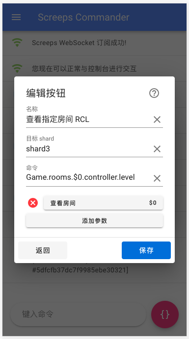

# screeps-commander

在线访问地址 [点击这里](https://hopgoldy.github.io/screeps-commander/)

本项目包含了用于和游戏 ”Screeps“ 进行交互的控制台以及一套用于快速发送命令的自定义按钮组。主要用于优化移动端的游戏控制台交互体验。本项目仅包含前端静态页面，所有需要用到的信息均保存于用户本地机器，不会上传至除 Screeps 官服之外的任何服务器。

<div>
    
    
    
</div>

## 技术栈

- 基本框架：Vue
- 类型支持：TypeScript
- 组件库：Vuetify
- 预编译样式：stylus
- 模板语言：pug
- 代码质量检查：ESLint

## 需求

- node: >= 10.13.0
- yarn: 最新版本

## 安装依赖
```
yarn install
```

## 使用

启动热更新 dev 服务
```
yarn serve
```

编译
```
yarn build
```

lint 检查
```
yarn lint
```

